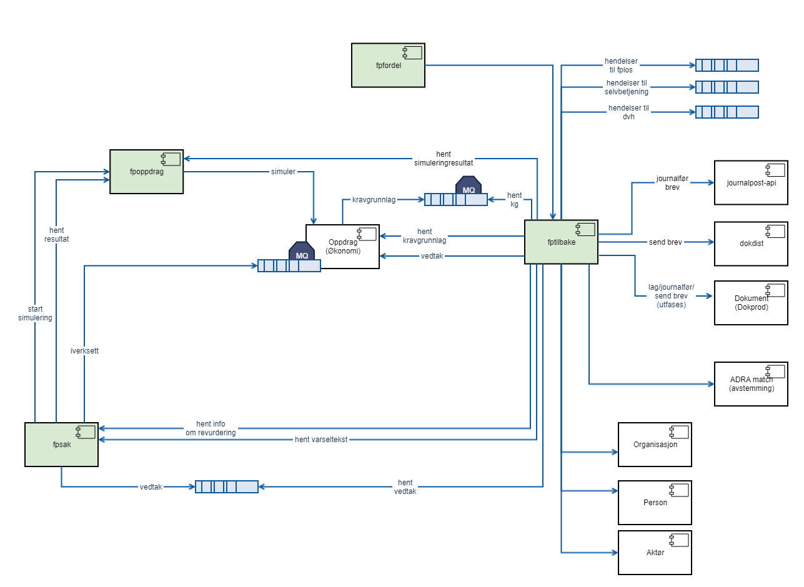
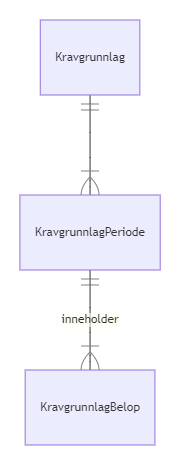
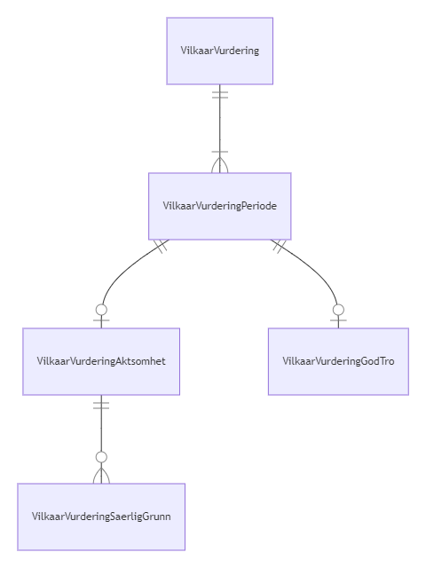
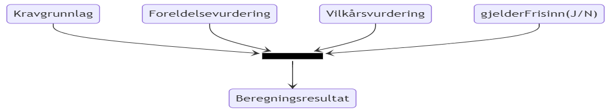
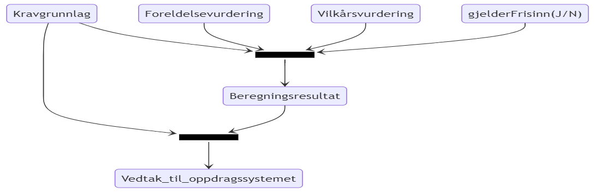

Applikasjonene fptilbake og k9-tilbake
===============

Dette er repository for applikasjonene:
 * fptilbake, en tilbakekrevingsapplikasjon for foreldrepenger, svangerskapspenger og engangsstønad.
 * k9-tilbake, en tilbakekrevingsapplikasjon for frisinn og kapittel 9-ytelser: pleiepenger for sykt barn, pleiepenger for syk nærstående, omsorgspenger, opplæringspenger

Løsningen deployes som to applikasjoner, for å understøtte de ulike områdenes behov på en god måte.

Kontaktinformasjon (Foreldrepenger):
* slack-kanal: `#fp-tilbakekreving` eller `#teamforeldrepenger` 

Kontaktinformasjon (Omsorgspenger, Pleiepenger, Opplæringspenger, Frisinn):
* slack-kanal: `#sykdom-i-familien`

# Lenker

* [Dokumentasjon fra Produktteam Foreldrepenger](https://confluence.adeo.no/pages/viewpage.action?pageId=358580006) Denne inneholder bl.a. funksjonell beskrivelse og driftsdokumentasjon
 

# Kontekst

Følgende viser kontekstdiagrammet for fptilbake. For k9-tilbake er det ganske likt: bytt ut fpsak med k9-sak, fpoppdrag med k9-oppdrag, og iverksetting mot OS går via k9-oppdrag isdf direkte fra k9-sak. 

# Kjør og test lokalt

Lokalt startes applikasjonene ved å kjøre en av klassene JettyFPDevServer eller JettyK9DevServer.

Nødvendig konfigurasjon:
* working directory må settes til å peke på modulen web (\web)
* classpath skal peke på modulen web-dev (\web-dev)

# Domene
## Fagsak
Tilbakekrevingsbehanlinger knyttes til en fagsak fra et fagsystem (les: fpsak/k9-sak). Dokumenter som produseres kobles også til fagsaken i journalføringen.

## Behandling
Det er flere typer behandlinger for tilbakekreving. De to førstnevnte er hovedbehandlingstypene. 
1. Tilbakekrevingsbehandling.
1. Revurdering av tilbakekrevingsbehandling.
1. Klagebehandling av foregående behandlinger. Klagebehandling er implementert i fpsak.

## Kravgrunnlag

Kravgrunnlag fåes fra Oppdragsystemet og er basis for hele behandlingen i applikasjonen. Kravgrunnlaget danner rammen for hva applikasjonen kan tilbakekreve;
det er kun mulig å tilbakekreve for de perioder som er i kravgrunnlaget, og innenfor det kravgrunnlaget sier er feilutbetalt beløp. Kravgrunnlaget forteller 
også hvilken behandling (uuid eller id) fra fagsystemet som var den siste som påvirket feilutbetalt beløp.

Kravgrunnlaget inneholder kun perioder som har feilutbetaling, og disse periodene er splittet på månedsgrenser. Kravgrunnlaget inneholder også informasjon om hvilket skattetrekk som ble brukt ved relevante utbetalinger, samt hvor mye skatt som ble trekt i hver måned; skatteopplysningene blir brukt til å gjøre tilbakekreving av nettobeløp.

Kravgrunnlaget brukes også ved iverksettelse. Resultatet for tilbakekrevingsbehandlingen projiseres ned på periodene i fra kravgrunnlaget, som så sendes til oppdragssystemet.

I koden finnes entitene Kravgrunnlag431, KravgrunnlagPeriode432, KravgrunnlagBelop433 som representerer domenet. Navnene er valgt for å være like med de som er i objektene som fåes fra økonomi.

I KravgrunnlagBeløp fra Oppdragssystemet mottas det noen ganger opplysninger som ikke er relevant for tilbakekrevingen (for eksempel ulike varianter av trekk). Disse blir ignorert.

## Logiske perioder

I løsningen opererer vi med et begrep "logisk periode" dette er omkringliggende periode rundt perioder fra kravgrunnlaget som ligger inntil hverandre, eller kun har opphold for helger (for ytelse som ikke utbetales i helger). Sammenslåingen gjøres for at saksbehandler kan behandle mange perioder under ett.  

## Fakta om feilutbetalingen

For hver logisk periode må saksbehandler dokumentere årsaken til feilutbetaling. Årsakene brukes for å dokumentere saken, og brukes også i vedtaksbrevet.

Se FeilutbetalingÅrsakRestTjeneste.

## Foreldelse

For hver logiske periode vurders det om perioden er foreldet. Hvis første dato er vesentlig yngre enn 3 år, blir den automatisk vurdert til å ikke være foreldet. I andre tilfeller gjør  saksbehandler vurderingen av dette. Logisk periode kan her splittes, slik at det kan være flere vurderinger pr.periode.

## Vilkår

For hver logisk periode (utenom de deler som er foreldet) skal saksbehandler gjøre en vurdering om vilkår for tilbakekreving er oppfylt. Logiske perioder kan splittes, slik at deler kan få ulik vurdering.

VilkårVurderinPeriode peker til enten VilkårVurderingAktsomhet, eller til VilkårVurderingGodTro. Det kommer an på hva saksbehandler har valgt under Aktsomhet

## Beregning

[Beregningsregler](https://confluence.adeo.no/display/TVF/H.+Beregningsregler)

For beregning brukes periodene fra vilkårsvurdering og foreldelsesvurdering, så perioder i beregningsresulatet er 1-1 mot disse.

Hovedsaklig består beregningen av at følgende utføres for hver periode fra vilkårsvurdering/foreldelsevurdering:
* finn feilutbetalt beløp for perioden ved å summere perioder fra kravgrunnlaget. Hvis en periode fra kravgrunnlaget bare overlapper delvis, vektes det etter antall virkedager overlapp.
* hvis perioden er foreldet, blir tilbakekrevingsbeløpet 0
* hvis perioden ikke er foreldet, blir tilbakekrevingsbeløpet bestemt enten ved at feilutbetalt beløp skaleres med en faktor vilkårsvurdering, eller satt til et bestemt beløp saksbehandler har valgt.
* hvis det ikke er frisinn, blir det lagt til renter (ikke som vanlige bankrenter, dette er et gebyr som alltid er 10% uavhengig av tid) om vilkårsvurderingen tilsier det

## Beregning-iverksettnig
Ved iverksetting fordeles periodene fra Beregningsresultatet ut på periodene fra kravgrunnlaget. Dette må gjøres på en måte slik at tilbakekreves 
beløp for hver kravgrunnlagperiode ikke overstiger feilutbetalt beløp i perioden, og også slik at summen i beregningsresultatet stemmer med summen
av det som har blitt fordelt på kravgrunnlagperiodene

## Resultatstrukturer

Det lagres i dag ingen resultatstrukturer. Istedet utledes resultatene on-demand basert på kravgrunnlag, foreldelsevurderinger og vilkårvurderinger.

## Data fra saksbehandlingssystemet

Det er en rekke data som brukes av fptilbake, og som hentes on-demand fra saksbehandlingssystemet. Dette gjelder:
* varseltekst (for første varsel)
* hvilket språk brukeren foretrekker
* hvilke valg saksbehandler har gjort angående tilbakekreving for behandlingen
* behandlende enhet
 

# Prosesser

## Prosess for Tilbakekrevingsbehandling

Hovedflyten for behandlinger av typen Tilbakekrevingsbehandling er:
1. Send varselbrev til bruker
1. Vent inntil følgende er oppfylt:
    1. Skaff kravgrunnlag fra Oppdragsystemet.
    1. Bruker har kommet med tilbakemelding (helst fra selvbetjeningsløsningen), eller tidsfrist går ut
1. Saksbehandler undersøker hvorfor feilutbetaling har oppstått for de ulike periodene, og dokumenterer det i løsningen. (se Fakta om feilutbetalingen)
1. Foreldelse vurders automatisk til Ikke foreldet. 
1. Saksbehandler vurder vilkår for tilbakekreving (Se Vilkår)
1. Saksbehandler ser resultatet og forhåndsvisning av vedtaksbrevet. Saksbehandler kan legge inn fritekst i utvalgte steder i brevet.
1. Saksbehandler foreslår vedtak og sender behandlingen videre til beslutter
1. Beslutter godkjenner vedtaket
1. Vedtaket iverksettes

Det er også mulig med flere varianter av dette, eksempelvis:
1. Saksbehandler kan i saksbehandlingsløsningen velge å **ikke** opprette varsel om tilbakekreving. Det vil da ikke ventes på at bruker kommer med tilbakemelding. 
1. Varianter med endring fra Øknoomi:
    1. Det kommer en AVSL-melding fra økonomi hvor som helst i prosessen. Det medfører at behandlingen automatisk henlegges.
    1. Det kommer en SPER-melding fra økonomi hvor som helst i prosessen. Det medfører at behandlingen går automatisk på vent, venter på nytt kravgrunnlag.
    1. Det kommer nytt kravgrunnlag fra økonomi hvor som helst i prosessen (vanligvis etter SPER-melding). Det medfører at Behandlingen går automatisk tilbake til Fakta om feilutbetalingen. Hvis feiltubetalt beløp har økt vesentlig, kommer saksbehandler til å sende ut korrigert varsel, og bruker får nye uker på å komme med tilbakemelding.   
1. Når perioder med mindre feilutbetalte perioder er gamle (nesten 3 år eller eldre) vurderes de manuelt. (se Foreldelse)
1. Saksbehandler ilegger tilleggsfrist, slik at perioder over 3 år gamle likevel ikke er foreldet.
1. Alle perioder ble vurdert som foreldet, da er det ikke noe å vurdere i Vilkår.
1. Beslutter underkjenner noen punkter. Det medfører at behandlingen automatisk settes tilbake til aktuelt punkt, og saksbehandler må rette opp det som var feil. 

## Prosess for Revurdering av tilbakekrevingsbehandling

En revurdering av tilbakekrevingsbehandling opprettes for eksempel når en klage fra bruker medfører at Nav skal endre tilbakekrevingsvedtaket.

Prosess er i hovedsak lik som Prosess for Tilbakekrevingsbehandling, men har følgende forskjeller:
1. Det ventes ikke på kravgrunnlag, kravgrunnlaget fro opprinnelig behandling hentes på nytt fra Økonomi istedet
1. Varsel sendes bare hvis saksbehandler velger å gjøre det
1. Hvis behandlingen ble opprettet på bakgrunn av en klage, blir det ikke sendt vedtaksbrev. Dette siden vedtaksbrev sendes fra et annet system.
 

# Integrasjoner

## Integrasjon mot Oppdragsystemet
TODO lenke til dokumentasjon (confluence)

TODO beskrivelse

## Integrasjon mot Fagsystemet

TODO lenke til dokumentasjon (confluence-siden til Produktteam foreldrepenger)

TODO beskrivelse.

TODO beskrivelse kobling av behandlinger

## Integrasjon for Brev

TODO beskrivelse av virkemåte, fritekstbrev+dokprod, vedlegg+joark

## Integrasjon for Avstemming

TODO beskrivelse

## Integrasjon mot Selvbetjening

TODO beskrivelse

## Integrasjon mot Produksjonsstyringsverktøy (fplos)

TODO beskrivelse. Skjermbilde?

## Integrasjon mot Registre

TODO beskrivelse (aktoer_v2, person_v3)

## Integrasjon mot Datavarehus (DVH)

TODO beskrivelse felles, saksstatistikk, vedtak
