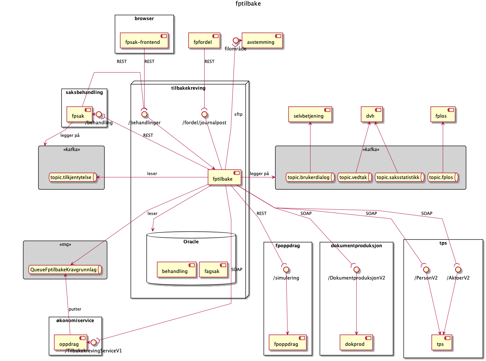

fptilbake
===============
Dette er repository for kildkode som dekker tilbakekrevingsløsning for foreldrepenger, svangerskapspenger og engangsstønad.

Kontaktinformasjon:
* slack-kanal: `#fp-tilbakekreving` 

# Kontekst

# Kjør og test lokalt

TODO

# Domene

## Fagsak
Tilbakekrevingsbehanlinger knyttes til en fagsak fra et fagsystem (les: fpsak). Mottatte dokumenter journalføres koblet til fagsaken.
## Behandling
Det er flere typer behandlinger for tilbakekreving. De to førstnevnte er hovedbehandlingstypene. 
1. Tilbakekrevingsbehandling.
1. Revurdering av tilbakekrevingsbehandling.
1. Klagebehandling av foregående behandlinger. Klagebehandling er implementert i fpsak.

### Prosess for Tilbakekrevingsbehandling

TODO figur for flyt (steg)

Hovedflyten for behandlinger av typen Tilbakekrevingsbehandling er:
1. Send varselbrev til bruker
1. Vent inntil følgende er oppfylt:
    1. Skaff kravgrunnlag fra Oppdragsystemet.
    1. Bruker har kommet med tilbakemelding (helst fra selvbetjeningsløsningen), eller tidsfrist går ut
1. Saksbehandler undersøker hvorfor feilutbetaling har oppstått for de ulike periodene, og dokumenterer det i løsningen. (se Fakta om feilutbetalingen)
1. Foreldelse vurders automatisk til Ikke foreldet. 
1. Saksbehandler vurder vilkår for tilbakekreving (Se Vilkår)
1. Saksbehandler ser resultatet og forhåndsvisning av vedtaksbrevet. Saksbehandler kan legge inn fritekst i utvalgte steder i brevet.
1. Saksbehandler foreslår vedtak og sender behandlingen videre til beslutter
1. Beslutter godkjenner vedtaket
1. Vedtaket iverksettes

Det er også mulig med flere varianter av dette, eksempelvis:
1. Saksbehandler kan i saksbehandlingsløsningen velge å **ikke** opprette varsel om tilbakekreving. Det vil da ikke ventes på at bruker kommer med tilbakemelding. 
1. Varianter med endring fra Øknoomi:
    1. Det kommer en AVSL-melding fra økonomi hvor som helst i prosessen. Det medfører at behandlingen automatisk henlegges.
    1. Det kommer en SPER-melding fra økonomi hvor som helst i prosessen. Det medfører at behandlingen går automatisk på vent, venter på nytt kravgrunnlag.
    1. Det kommer nytt kravgrunnlag fra økonomi hvor som helst i prosessen (vanligvis etter SPER-melding). Det medfører at Behandlingen går automatisk tilbake til Fakta om feilutbetalingen. Hvis feiltubetalt beløp har økt vesentlig, kommer saksbehandler til å sende ut korrigert varsel, og bruker får nye uker på å komme med tilbakemelding.   
1. Når perioder med mindre feilutbetalte perioder er gamle (nesten 3 år eller eldre) vurderes de manuelt. (se Foreldelse)
1. Saksbehandler ilegger tilleggsfrist, slik at perioder over 3 år gamle likevel ikke er foreldet.
1. Alle perioder ble vurdert som foreldet, da er det ikke noe å vurdere i Vilkår.
1. Beslutter underkjenner noen punkter. Det medfører at behandlingen automatisk settes tilbake til aktuelt punkt, og saksbehandler må rette opp det som var feil. 

### Prosess fro Revurdering av tilbakekrevingsbehandling

En revurdering av tilbakekrevingsbehandling opprettes for eksempel når en klage fra bruker medfører at Nav skal endre tilbakekrevingsvedtaket.

Prosess er i hovedsak lik som Prosess for Tilbakekrevingsbehandling, men har følgende forskjeller:
1. Det ventes ikke på kravgrunnlag, kravgrunnlaget fro opprinnelig behandling hentes på nytt fra Økonomi istedet
1. Varsel sendes bare hvis saksbehandler velger å gjøre det
1. Hvis behandlingen ble opprettet på bakgrunn av en klage, blir det ikke sendt vedtaksbrev. Dette siden vedtaksbrev sendes fra et annet system.
 

## Data fra saksbehandlingssystemet

Det er en rekke data som brukes av fptilbake, og som hentes on-demand fra saksbehandlingssystemet. Dette gjelder:
* varseltekst (for første varsel)
* hvilket språk brukeren foretrekker
* hvilke valg saksbehandler har gjort angående tilbakekreving for behandlingen
* behandlende enhet

## Kravgrunnlag

Kravgrunnlag fåes fra Oppdragsystemet og er basis for hele behandlingen i fptilbake.

Kravgrunnlaget sier:
* feilutbetalte perioder
* feilutbetalt beløp
* skatteprosent pr. periode
* klassekoder 

## Fakta om feilutbetalingen

Perioder fra kravgrunnalget slås sammen, og saksbehandler dokumenterer årsaken til hvorfor periodene ble feilutbetalte.

TODO beskrivelse, datamodell, skjermbilde

## Foreldelse

TODO beskrivelse, datamodell, skjermbilde

## Vilkår

TODO beskrivelse, datamodell, skjermbilde

## Beregning
TODO lenke til beregningsregler (eller kopier inn i dokumentasjonen) 

## Beregning-iverksettnig
TODO forklar hvordan kravgunnlag+beregning transformeres til vedtak som sendes til Oppdragssystemet

## Resultatstrukturer

Det lagres i dag ingen resultatstrukturer. Istedet utledes resultatene on-demand basert på kravgrunnlag, foreldelsevurderinger og vilkårvurderinger.

# Integrasjoner

## Integrasjon mot Oppdragsystemet
TODO lenke til dokumentasjon (confluence)

TODO beskrivelse

## Integrasjon mot Fagsystemet

TODO lenke til dokumentasjon (confluence-siden til Produktteam foreldrepenger)

TODO beskrivelse.

TODO beskrivelse kobling av behandlinger

## Integrasjon for Brev

TODO beskrivelse av virkemåte, fritekstbrev+dokprod, vedlegg+joark

## Integrasjon for Avstemming

TODO beskrivelse

## Integrasjon mot Selvbetjening

TODO beskrivelse

## Integrasjon mot Produksjonsstyringsverktøy (fplos)

TODO beskrivelse. Skjermbilde?

## Integrasjon mot Registre

TODO beskrivelse (aktoer_v2, person_v3)

## Integrasjon mot Datavarehus (DVH)

TODO beskrivelse felles, saksstatistikk, vedtak
